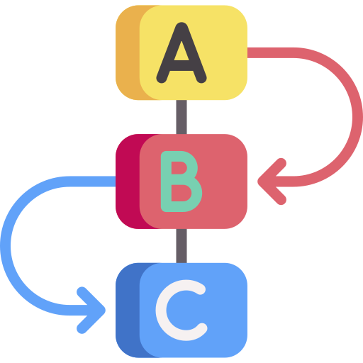
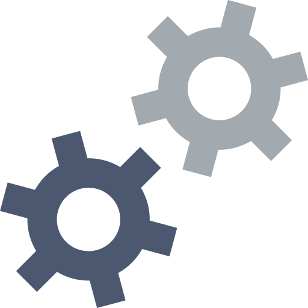

  

    <h1>Easy to use</h1>
    
It greatly simplifies coding of complex stateful distributed applications.

    

      

        
      

      

        
Workflows provide primitives to allow application developers to express complex business logic as code.

        
The underlying platform abstracts scalability, reliability and availability concerns from individual developers/teams.

      

    

  

  

    <h1>Fault tolerant</h1>
    
Cadence enables writing stateful applications without worrying about the complexity of handling process failures.

    

      

        
Cadence preserves complete multithreaded application state including thread stacks with local variables across hardware and software failures.

        
A cadence workflow is a distributed virtual process which is not tied to any host.

        
It can survive node failures and restarts and can keep track of your process’ state for you.

      

      

        
      

    

  

  

    <h1>Scalable</h1>
    
At the same time it is scalable and robust enough to power hundreds of critical use cases at Uber and outside.

    

      

        
      

      

        
Cadence is designed to scale out horizontally to handle millions of concurrent workflows.

        

        

      

    

  

