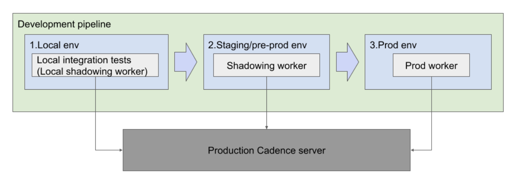

# Design doc: Cadence Workflow Shadowing

Author: Yu Xia (@yux0), Yichao Yang (@yycptt)

Last updated: Apr 2021

Reference: [#2547](https://github.com/uber/cadence/issues/2547)

## Abstract 

Cadence client libraries use workflow history and workflow definition to determine the current workflow state which is used by the workflow (decision) task for deciding the next step in the workflow. Workflow histories are immutable and persisted in the Cadence server, while workflow definitions are controlled by users via worker deployments. 

A non-deterministic error may happen when re-building the workflow state using a version of the workflow definition that is different than the one generating the workflow history. Typically caused by a non-backward compatible workflow definition change. For example:

| Version | Workflow Definition | Workflow History |
| --------| --------------------| ---------------- |
| V1 | 1. Start workflow 2. Start activity A 3. Complete workflow | 1. Workflow started 2. Activity A started |
| V2 | 1. Start workflow 2. Start activity B 3. Complete workflow | 1. Workflow started 2. Activity B started |

When a Cadence client uses V1 history and V2 definition to build the workflow state, it will expect information of activity A in the workflow state as it sees an activity started event for it. However, it's unable to find Activity A since another activity is specified in V2 definition. This will lead to a non-deterministic error during workflow (decision) task processing. 

Depending on the non-deterministic error handling policy, the workflow will fail immediately or get blocked until manual operation is involved. This type of error has caused several incidents for our customers in the past. What make the situation worse is that understanding and mitigating the non-deterministic error is usually time-consuming. Blindly reverting the bad deployment will only make the situation worse as histories generated by the new workflow definition are also not compatible with the old one. The right mitigation requires not only manual operations, but also a deep understanding of why the non-deterministic error is happening, which will greatly increase the time needed to mitigate the issue.

### Goals

- The goal of this project is to detect the non-deterministic errors in pre-prod environments, notify customers on this error and reduce the number of incidents caused by the non-deterministic errors.

### Non-Goals

- 100% prevent non-deterministic errors: this project will not provide a bulletproof solution to prevent non-deterministic errors from happening in production.
- Provide mitigation solutions to non-deterministic errors: this project will not focus on how to solve existing non-deterministic errors for customers.

## Proposal

The proposal is creating a new worker mode called shadowing which reuses the existing workflow replay test framework available in both Golang and Java clients to only execute replay tests using the new workflow definition and workflow histories from production environments. 

When the user worker is running in the shadowing mode, the normal activity and decision worker component will not be started, instead a new replay worker will be started to replay production workflow histories. More specifically, this replay worker will call the `ScanWorkflowExecution` API to get a list of workflow visibility records and then for each workflow, get the workflow history from Cadence server by calling `GetWorkflowExecutionHistory` API and replay it against the new workflow definition using the client side replay test framework. Upon replay failure, metrics and log messages will be emitted to notify the user that there are non-deterministic changes in the new workflow definition. 

Note that as long as the worker can talk to the Cadence server to fetch visibility records and workflow history, it can be run in the shadowing mode. This means users have the flexibility to run it in the local environment during development to facilitate a rapid development cycle or/and make it part of the deployment process to run on a dedicated host in staging/preprod environment to get a better test coverage and catch rare cases. 

Users will also have the option to specify what kind of workflows they would like to shadow. As an example, if the user doesn’t use the query feature, then shadowing for the closed workflow may not necessary. Or if a user only changed the definition for one workflow type, only workflow histories of that type need to be shadowed and checked. Please check the Implementation section for the detailed options users have.

The major advantages of this approach are:
- **Simplicity**, very little code change required for Cadence server
- **Can be run in both local and staging/preprod/canary environments**
- **Generic approach that fits our internal deployment process, CI/CD pipeline and also open source customers**. 

The downsides however are:
- **Requires some effort on the user end** to setup the release pipeline and shadowing environment and we need to provide guidelines for them. 
- The **load on Cadence server and our ElasticSearch cluster will increase** due to the added `GetWorkflowExecution` and `ScanWorkflowExecutions` call. But this increase can be easily controlled by the server side rate limiter. Check the “Open Questions” section for an estimate for the load. 
- The dedicated **shadow worker will become idle after the replay test is done**.

## Other Considered Options

### [History Generation with task mocking](https://github.com/uber-go/cadence-client/issues/1050)

The idea of this approach is similar to the local replay test framework. But instead of asking customers to get an existing workflow history from production, it will ask customers to define possible workflow inputs, activity input/output, signals, etc. and then generate multiple workflow histories based on different combinations of values based on a certain workflow version. Random errors will also be injected to cover failure cases. Upon workflow code change, those generated workflows can be replayed against the new workflow definition to see if there are any non-deterministic changes.

The approach can be viewed as some form of automated test where test cases are auto-generated based on various inputs to the workflow. As it can validate the changes through local tests, **the development cycle can be faster**. This could improve the local development experience and could be considered in vNext phase.

However, this also means that **users need to learn a set of new APIs** for specifying different types of inputs and update the test if there are new activities or signal channels. **Coverage might also be a concern** as many inputs are coming from upstream services, like Kafka, and it’s hard to specify all different possible parameters. Finally, from an implementation perspective, the new automated test framework is **language specific** and needs the effort to re-design API and re-implement for different client libraries.

### Integration test with archived (partial) history

This approach reuses existing history archival code paths to dump workflow histories that match a certain query to blob storage. When a user changes the workflow code, they can connect to the blob storage, and run an integration test locally to replay all of the archived history to see if there’s a non-deterministic error. Since not all blob storage support List operation when there's a large number of items, we may also need to rely on visibility archival for getting a list of workflowIDs and runIDs.

The approach **doesn’t require too many changes on server end** as most code paths for history/visibility archival can be reused. We only need to figure out when and how to sample the workflow for archiving, and the destination for archiving. It also **avoids the idle worker problem** and **won’t incur any load increase on Cadence server** as the testing framework will talk directly to the storage for storing archived history and visibility records.

There are also several downsides associated with this approach:
- We need to decide who owns and manages the blob storage. 
  - If Cadence owns it, GDPR constraints might be a concern as some workflow histories will contain PII data and can’t be archived for too long. **A set of APIs for managing the storage** will also be necessary. 
  - Register user callbacks for managing storage.
  - If users own it, it will **increase their burden for managing it**. E.g. regularly clean up the unneeded workflows (may due to GDPR constraints), update query to replay only recent workflows to ensure a reasonable test time.
- Extra work for setting additional history and visibility archival systems.
- The integration test may take a long time to replay all the archived workflows **making it not ideal to run locally**. 
- Since the test is long running and not part of the deployment process, **users may tend to skip the test** if they believe the change they made is backward-compatible and causing issues when deployed to production.
- From an open source perspective, users need to have an archival system setup, which we only support S3 and GCP for now. If those two don't work for the customer, they may have to **implement their own archiver**. On the client side, we can provide a blob storage interface, but customers still need to **implement the logic for fetching history and/or visibility records for blob storage**.
- Finally since this approach takes blob storage as an external dependency, it **won’t be functioning when the dependencies are down**. 

### Replication based replay test

The final approach is: reusing the replication stack to dispatch decision tasks to workers at the standby cluster and perform the replay check. However this approach only works for global domain users, so it’s not a valid option. 

## Implementation

### Worker Implementation

In the proposal of workflow shadowing, the worker does shadowing traffic in 3 steps. 
1. Get a list of workflow visibility records.
2. For each record, get the workflow history.
3. Run the replay test on the workflow history.

These steps can be implemented in native code or in Cadence workflow. 

For the local development environment, we will provide a testing framework for shadowing workflow from production, so that users can validate their change sooner and speed up their development process. This kind of integration test can also be easily integrated with existing release pipelines to enforce a check upon landing code.

For staging/production environment, we incline to use a Cadence workflow to control the shadowing because of the following advantages:
1. **Scalability**: support large shadowing traffic.
2. **Extensibility**: easy to extend to different languages.
3. **Maintenance**: no special worker code to support the shadowing mode.
4. **Visibility**: shadowing progress and result can easily be viewed using the Cadence Web UI and metric dashboards.

As metrics will be emitted during the shadowing processing, it can also be integrated with release pipelines for checking workflow compatibility before deploying to production environments. The disadvantage is that users are required to start a Cadence server to run the shadow workflow. 

### Shadow Worker Options

The following options will be added to the Worker Option struct in both Golang and Java client:
- **EnableShadowWorker**: a boolean flag indicates whether the worker should run in shadow mode.
- **ShadowMode**:
  - **Normal**: stop shadowing after a scan for all workflows, this will be the default selected value. A new iteration will be triggered upon worker restart or deployment.
  - **Continuous**: keep shadowing until the exit condition is met. Since open workflows will keep making progress, two replays might lead to different results. This mode is useful for user’s whose workflow will block on a long timer. 
- **Domain**: user domain name.
- **TaskList**: the name of the task list the shadowing activity worker should poll from.
- **ShadowWorkflowQuery**: a visibility query for all the workflows that need to be replayed. If specified the following three options will be ignored.
- **ShadowWorkflowTypes**: a list of workflow types that need to be checked.
- **ShadowWorkflowStartTimeFilter**: a time range for the workflow start time.
- **ShadowWorkflowStatus**: a list of workflow status. Workflow will be checked only if its close status is in the list. Option for open workflow will also be provided and will be the default.
- **SamplingRate**: a float indicating the percentage of workflows (returned by workflow scan) that should be replayed.
- **Concurrency**: concurrency of replay checks, which is the number of parallel replay activities in the shadow workflow. 

### Local Shadow Test Options

The options provided by the local test framework will be similar to the shadow worker options, but as in tests there’s only one single thread for scanning and replaying, only concurrency equal to 1 will be accepted. The option for EnableShadowWorker, Domain, and TaskList will also be removed.

### Workflow Code Ownership

We decide to keep the workflow code at the server side due to the following reasons:
1. The shadowing logic for Java and Go clients are identical. By keeping the shadowing workflow definition at the server side, we only need to implement it once, and don’t need to worry about keeping two workflow definitions in sync.
2. Since Cadence server owns the workflow code, we can update the workflow definition at any time and even make non-backward compatible changes without having to ask customers to update their client dependency. 

The downsides are:
1. Cadence team needs to provide workers to process the decision task generated by the shadowing workflow.
2. Shadowing workflow from all the customers will live in one domain, so they may affect each other’s execution as the total amount of resources allocated to a given domain is limited.
   
However, considering the fact that the load generated by shadowing workflow is small and it’s unlikely many users will run the shadowing workflow at the same time, those downsides should not be a concern.

### Metrics

The following metrics will be emitted in the shadow workflow:
1. Number of succeeded/skipped/failed workflow replays
2. Latency for each replay test
3. Start/Complete/Continue_as_new of shadow workflow
4. Latency for each shadow workflow

