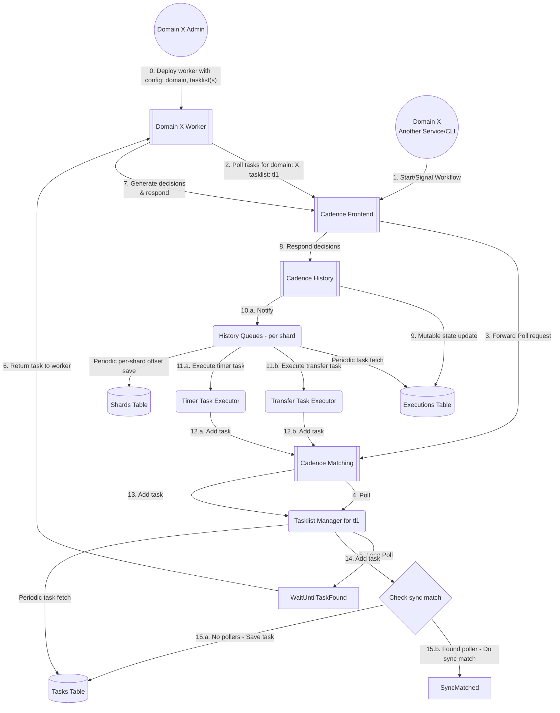

# Flow of tasks

Below diagram explains (to certain level of detail) how a workflow is processed by Cadence workers and backend components.

[comment]: <> (To visualize mermaid flowchart below, install Mermaid plugin for your IDE. Works in github out of the box)

