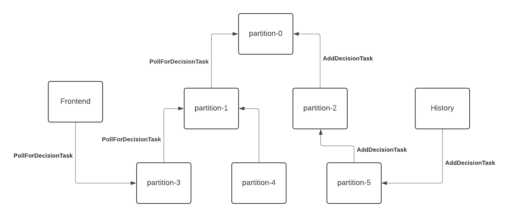

# Overview
Matching is a sharded service which is sharded by tasklist, which means that all requests to a certain tasklist has to be processed by one Matching host. To avoid a single Matching host becoming the bottleneck and make the system scalable, scalable tasklist was introduced to allow a tasklist to be partitioned so that the requests can be processed by multiple Matching hosts. The partitions are transparent to customers, so when a request to a scalable tasklist arrives at Cadence server, it has to select a partition for the request. We'll describe the architecture of scalable tasklist and the selection algorithm we use.

# Requirements
There are 2 requirements for this feature:

1. Ensure a fair distribution of the requests among all partitions
2. Maximize the utilization of customer pollers

The first requirement is straightforward, which is the reason for introducing scalable tasklist. The second requirement is to make sure pollers are not waiting at a partition without any task because the default polling timeout is 60s.

# Architecture

The partitions are organized in a tree-structure. The number of child nodes is configurable, but in the diagram we just show a scalable tasklist with 6 partitions organized in a binary tree. When a partition receives a request, it can forward the request to its parent partition recursively until the root partition being reached.

# Configuration
The number of partitions of a tasklist is configured by 2 dynamicconfigs:

1. [matching.numTasklistReadPartitions](https://github.com/uber/cadence/blob/v1.2.13/common/dynamicconfig/constants.go#L3350)
2. [matching.numTasklistWritePartitions](https://github.com/uber/cadence/blob/v1.2.13/common/dynamicconfig/constants.go#L3344)

The tree-structure and forwarding mechanism is configured by these dynamicconfigs:

1. [matching.forwarderMaxChildrenPerNode](https://github.com/uber/cadence/blob/v1.2.13/common/dynamicconfig/constants.go#L3374)
2. [matching.forwarderMaxOutstandingPolls](https://github.com/uber/cadence/blob/v1.2.13/common/dynamicconfig/constants.go#L3356)
3. [matching.forwarderMaxOutstandingTasks](https://github.com/uber/cadence/blob/v1.2.13/common/dynamicconfig/constants.go#L3362)
4. [matching.forwarderMaxRatePerSecond](https://github.com/uber/cadence/blob/v1.2.13/common/dynamicconfig/constants.go#L3368)

# Selection Algorithms
The selection algorithms are implemented as a LoadBalancer in [client/matching package](https://github.com/uber/cadence/blob/v1.2.13/client/matching/loadbalancer.go#L37).

## Random Selection
This is the first algorithm and it's been widely adopted in production. It's completely stateless and uses a shared nothing architecture. The probabilistic model of discrete uniform distribution guarantees the fairness of the distribution of requests. And the utilization is improved by the tree-structure. For example, as shown in the diagram, if a task is produced to partition-5, but a poller is assigned to partition-3, we don't want the poller to wait at partition-3 for 60s and retry the poll request. And the retry has a 5/6 probability of not hitting partition-5. With the tree-structure and forwarding mechanism, the poller request and task are forwarded to root partition. So an idle poller waiting at partition-3 is utilized in this case.

## Round-Robin Selection
This algorithm also ensure a fair distribution of requests even with a small number of requests. It also uses a shared nothing architecture but it's soft stateful because it uses a cache to remember the previous selected partition.

## Weighted Selection
The algorithm selects a partition based on the backlog size of each partition if any partition has a backlog size larger than 100. If all partitions don't have a large backlog, it falls back to round-robin selection. It can be proven mathematically that it's better than the previous 2 algorithms.

For a tasklist with $N$ partitions, assuming the number of tasks in each partition is represented by $L_i$, the utilization fraction of partition $i$ is:

$$U_i = \frac{L_i}{\Sigma_{i=0}^{n-1}L_i}, \forall i \in \{0,1,..,N-1\}$$

According to Little's Law, in a stable queue system, the average number of tasks in a queue

$$L = \lambda W$$

 where $\lambda$ is the average arrival rate and $W$ is the average wait time a task spends in the queue. A queue is stable if the utilization factor $\rho$ is less than 1, where

 $$\rho = \frac{\lambda}{X\mu}$$

Here $\lambda$ is the arrival rate of tasks, $\mu$ is the service rate of a single poller, and $X$ is the number of pollers. However, there might be some time that $\rho$ is greater than 1, in which case, tasks are not dropped but persisted into the database. Assuming the number of tasks in the database for partition $i$ is $B_{i}$, the arrival rate is $\lambda_{i}$, the utilization fraction is:

$$U_i = \frac{B_i+\lambda_iW}{\Sigma_{i=0}^{n-1}B_i+W\Sigma_{i=0}^{n-1}\lambda_i}, \forall i \in \{0,1,..,N-1\}$$

To maximize the utilization of pollers, the probability of partition $i$ being selected for a poller should be:

$$P_i = U_{i}, \forall i \in \{0,1,..,N-1\}$$

Assuming $B_i=0, \forall i \in \{0,1,..,N-1\}$ and $\lambda_i=\frac{\lambda}{N}, \forall i \in \{0,1,..,N-1\}$,

$$P_i = \frac{1}{N}, \forall i \in \{0,1,..,N-1\}$$

It means that when the queue system is stable and the producer traffic is evenly distributed among all partitions, selecting partition based on number of tasks is equivalent to random and round-robin selection.

Here λ is the producer QPS and W is the average matching latency. In production, we observed that the average matching latency is about 10ms, and most tasklists only have a few hundred producer QPS of traffic. So for most stable partitions, $L$ is less than 10. So if no partition has a very large backlog size, it's safe to fallback to random selection or round-robin selection algorithm.
